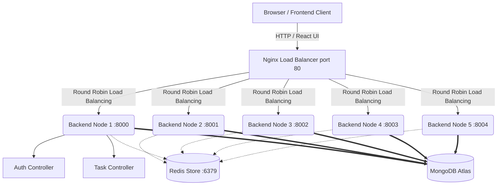

# PrimeTrade.ai - Backend Developer Internship Assignment


A production-grade, horizontally scalable task management web application built to fulfill the PrimeTrade.ai Backend Developer (Intern) assignment. The solution features a robust architecture utilizing a Node.js/Express backend running behind an Nginx load balancer natively scaled across 5 instances, a Redis cache layer for high performance and rate limiting, a strict MongoDB Atlas integration, and a glass-morphic React/Vite front-end.

## 🌟 Key Features

*   **Load-Balanced Architecture:** Nginx acts as a reverse proxy, distributing traffic in a round-robin format across 5 distinct Express.js backend instances (running vertically on ports 8000–8004).
*   **Centralized Caching (Redis):** Integrates Redis as a single source of truth for global caching (60s TTL on task retrieval) and automatic cache invalidation during data mutation (Create, Update, Delete).
*   **Global & Route-Specific Rate Limiting:** Enforces strict API limits (100 req/min globally, 20 req/15min for Auth routes) using an `express-rate-limit` + `RedisStore` implementation securely shared across all scalable nodes.
*   **Authentication & Role-Based Access Control (RBAC):** Token-based authentication using completely manual bcrypt hashing within the controllers. Separate environments dynamically render views and API access between `admin` (view all tasks) and standard `user` (isolated scope).
*   **Strict Input Sanitization:** Dual-layer implementation of **Zod** schema validations on the frontend (before transmission) and the backend (middleware validation), preventing malicious payloads.
*   **Comprehensive Logging:** Integrates `Winston` combined with `Morgan` for console transport debugging alongside daily rotating JSON log files structure.
*   **Containerized Orchestration:** Utilizing `docker-compose`, the entire application runs effortlessly in a sandboxed, automated multi-container setup (spanning React, Node, Redis, and Nginx images). 
*   **Premium Quality UI:** Developed a responsive aesthetic frontend utilizing React.js, Vite, and detailed CSS modules offering native glass-morphism, dark-mode styling, micro-animations, and dynamic visual rate-limit countdown banners that intercept HTTP 429 status codes.

---

## 🏗 System Architecture 



---

## 🚀 Quick Start (Docker)

To deploy the entire stack immediately using Docker:

#### 1. Clone the repository
```bash
git clone https://github.com/PHYNiX29/Mern-Auth.git
cd Mern-Auth
```

#### 2. Configure Environment Variables
You must initialize connection secrets. 
```bash
cp backend/.env.example backend/.env
```
Edit `backend/.env` with your secure configuration parameters:
```ini
MONGO_URI=mongodb+srv://<user>:<password>@cluster0.xxxxx.mongodb.net/primetrade?retryWrites=true&w=majority
JWT_SECRET=your_super_secure_secret_key_string
REDIS_URL=redis://redis:6379
RATE_LIMIT_WINDOW_MS=60000
RATE_LIMIT_MAX=100
```

#### 3. Build & Orchestrate
Run the entire containerized orchestration:
```bash
docker compose up -d --build
```

#### 4. Access the Stack Applications
| Component | URL Endpoint | Description |
|-----------|--------------|-------------|
| **Frontend UI** | `http://localhost` | The primary React application seamlessly routed via Nginx. |
| **Swagger Docs** | `http://localhost/api/docs` | Comprehensive interactive API documentation. |
| **API Health** | `http://localhost/health` | Round-robin reverse-proxied health statuses evaluating backend nodes. |

---

## 🔌 API Documentation

Detailed Swagger UI documentation is available at `/api/docs` exposing standard HTTP compliance paths:

| Domain | Method | Endpoint | Authorization | Description |
|--------|--------|----------|---------------|-------------|
| **Auth** | POST | `/api/v1/auth/register` | Public | Register a new user (`user` or `admin` role). |
| **Auth** | POST | `/api/v1/auth/login` | Public | Authenticate a user & receive JWT logic. |
| **Auth** | GET | `/api/v1/auth/me` | Bearer Token | Retrieve currently authenticated user context. |
| **Task** | GET | `/api/v1/tasks` | Bearer Token | Highly Redis Cached fetching of User/Admin task lists. |
| **Task** | POST | `/api/v1/tasks` | Bearer Token | Create a new task (Invalidates Redis Cache). |
| **Task** | PATCH | `/api/v1/tasks/:id` | Bearer Token | Update a specific task detail structure. |
| **Task** | DELETE | `/api/v1/tasks/:id` | Bearer Token | Delete task completely. |

---

## ☁️ Deployment Guidelines

The project was explicitly engineered for simple horizontal continuous deployment, utilizing native containers applicable to hosts like **Railway**, **Render**, or generic VPS setups.

1. Create a dynamic service pointing to the `backend/Dockerfile` configured over Node 20.
2. Enable a parallel Redis configuration / container instance and link it into `REDIS_URL`.
3. Provide Native MongoDB Atlas access logic into the service's environment configuration payload.
4. Scale up the underlying replica containers. 

For Railway: Simply utilize `railway up` passing the provided `railway.toml`.

> **Note:** Serverless environments (e.g., Vercel) are not intrinsically structured for load-balanced Nginx and parallel networking orchestrations. Containerized platforms (Railway, Render) are highly recommended.
